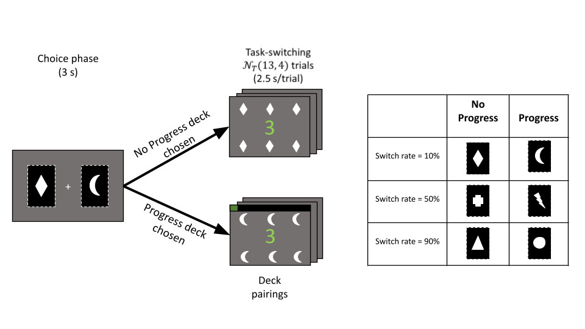

``` {r initialize equation count, echo=F} 
eqnum = 0
```

# Preamble
In this tutorial, I want do to four things: 

* Demonstrate how to compute and interpret (multilevel) logistic regression models;

* Demonstrate how to create a design matrix for categorical predictor variables and interpret associated coefficients; 

* Demonstrate how to check assumptions for logistic multilevel models; 

* Apply all of these techniques to data I collected about people's effort preferences. 

To do so, I will first introduce the theory underlying logistic (multilevel) regression. Then I will describe the data set we will be working with, along with the hypotheses and research question. Next I will fit a series of logisitc MLM to test these hypothesis and will conclude by demonstrating how to test assumptions on these models. 

All data for this tutorial are available on my [github](https://github.com/seandamiandevine/747final). 

# Logistic Regressions, Probabilities, and Odds Ratios
## Basics of Logistic Regressions
Logistic regressions are a specicial case of general linear regression models used to model data when the outcome variable is binary. Binary variables are useful for measuring many variables of interest in psychology: whether a professor has tenure or not, someone's biological sex, and, as we will see, choices in a decision-making experiment. The problem is that the models we have seen in class are *linear* multilevel models. In other words, they are models where you have to be able to draw a line between data points. When we have binary data, this is a problem. 

To illustrate this, let's work with the following (made-up) example. Imagine we collect data on whether someone will answer "yes" or "no" to the question: "Will you go on a data with me?" We predict that their answer will depend on how beautiful the person asking is (0 = not beautiful at all to 200 = very beautiful). **Figure 1a** shows what these data might look like^[These data are simulated. Hopefully people are not this shallow in real life.]. 

```{r beauty example plots, echo=F, fig.height=6, fig.align='center', fig.cap='From binary data to linear models.'}
probs = seq(0, 1, by=0.05)
choices = sapply(1:length(probs), function(x) sample(c(0, 1), size=10, 
                                                     prob=c(1-probs[x], probs[x]), 
                                                     replace = T))
choices = as.vector(choices)
beauty <- 1:length(choices)
linreg <- lm(choices~beauty)
linpredict <- predict(linreg)
simreg <- glm(choices ~ beauty, family='binomial')
simpredict <- predict.glm(simreg, newdata = data.frame(beauty=beauty), type='response')

layout(matrix(1:4, 2,2, byrow=T))
plot(x=beauty, y=choices, ylab='Will you go on a date with me?', 
     yaxt='n')
axis(2, at=c(0, 1), labels = c('0 (no)', '1 (yes)'))
text(labels='a', 
     x=grconvertX(0.05, from="nfc", to="user"),
     y= grconvertY(0.94,  from="nfc", to="user"), 
     xpd=T, cex=2, font=2)


plot(x=beauty, y=choices, ylab='Will you go on a date with me?', 
     yaxt='n')
axis(2, at=c(0, 1), labels = c('0 (no)', '1 (yes)'))
lines(linpredict)
text(labels='b', 
     x=grconvertX(0.05, from="nfc", to="user"),
     y= grconvertY(0.94,  from="nfc", to="user"), 
     xpd=T, cex=2, font=2)


plot(x=beauty, y=choices, ylab='Probability of saying yes')
lines(simpredict)
text(labels='c', 
     x=grconvertX(0.05, from="nfc", to="user"),
     y= grconvertY(0.94,  from="nfc", to="user"), 
     xpd=T, cex=2, font=2)

lor <- log(simpredict/(1-simpredict))
plot(x=beauty, y=lor, type='l', 
     ylab = 'LOR')
text(labels='d', 
     x=grconvertX(0.05, from="nfc", to="user"),
     y= grconvertY(0.94,  from="nfc", to="user"), 
     xpd=T, cex=2, font=2)
```

As we can see, this does not look like the typical scatterplot we would get from a linear model, where the relationship between the variable on the x-axis and the y-axis is immediately clear (e.g., when $x$ goes up, so does $y$). This is because the variable on the y-axis is binary: people can only say "yes" or "no" to a date (here we have dummy coded "yes" and "no" as 1 or 0, respectively). Each point represents one answer. 

While maybe a little foreign, we can still learn something from this figure. Namely, we can see that there are more "no" points when beauty is low and more "yes" points when beauty is high. Naively, we might conclude something like: "people say yes to dates more often when the person asking is more beautiful". This is an intuitive conclusion to reach, but the goal of statistical modeling is that we can make more nuanced claims about the relationship between beauty and likelihood of getting a date than just the raw frequencies allow us to. 

If we model these data in the traditional way, using a linear model, we would get something like **Figure 1b**. Here, the values on the regression line are computed the same way as usual for a level-1 model: 
$$
\tag{`r  eqnum=eqnum+1; eqnum`}
Date_{i} = \beta_0 + \beta_1Beauty_i
$$
At first glance, this approach might seem reasonable: better-looking people get more dates. There are two problems, however. The first is rather intuitive: some values on the regression line are impossible. What would it mean for a value to exceed 1; to say "more than yes" to a date. The second is slightly more techincal. In linear regression, the variance is estimated as a free parameter ($\sigma^2$ or $\Lambda$ for a covariance matrix), but in logistic regression the variance *depends on* on the mean (i.e., the probability of an event occuring, $p$), such that $var(y_{ij}) = p(1-p)$. This means that by definition there is heteroscedasticity, because the variance is not constant across observations, which is an assumption of linear regression. 

Still, there is something intuitive about the linear approach. In fact, if we changed the y-axis so that these impossible values went away, we would have something that makes sense. To solve this problem, we can estimate the *probability* of someone saying yes to a date, rather than the binary answer. This would fixe both our problems, because probabilities are bound from 0 to 1 and are interpretable in a continuous manner. The question is how do we move from binary data to probabalistic data? Fortunately, we can use a *logistic* function to do so: 

$$ 
\tag{`r  eqnum=eqnum+1; eqnum`}
logistic(\eta) = \frac{1}{1+e^{-\eta}}. 
$$ 

The logistic function^[$e$ here is Euleur's constant, which is approximately equal to 2.718282] squeezes the output from our linear model to be between between 0 and 1, which we use to represent probabilities of responding. As an input, it takes $\eta$, which in our regression framework is the predicted value of $y$ from our linear model (i.e., the result of $\beta_0 + \beta_1Beauty_i$). We can see what this function looks like for our data in **Figure 1c**. The characteristic *S-curve* better represents our earlier intuition: the better-looking someone is, the higher probability with which they'll get a date. 

While transforming our data using a logistic function fixes our the issue of impossible values on our regression line, we have lost the nice linear function we had in **Figure 1b**. As such, we cannot apply the (multilevel) *linear* techniques we have learned in class and previously in our statistical training. To move from this non-linear logistic function to a linear one, we have to "invert" this logistic function to recover the linear relationship we lost. In other words, we want to get back to something like $Date_i = \beta_0 + \beta_1Beauty_i$, while keeping interpretable values for every predicted value of $Date_i$ and solving the issue of heteroscedasticity. To do so, we can use the following equation. 

$$ 
\tag{`r  eqnum=eqnum+1; eqnum`}
log\left(\frac{p(y_i = 1)}{p(1-y_i= 1)}\right) = \beta_0 + \beta_1Beauty_i
$$

Now, our outcome is no longer the probability that $y_i = 1$, but instead the the **log odds of $y_i$ being equal to 1** (which in this case means saying "yes" to a date). This is simply the natural logarithm of the probability that $y_i = 1$ (which we got from our sigmoidal function earlier) over the probability that $y_i \neq 1$. Therefore, we can easily move from log odds (LOR) to regular odds ratios (OR) to probability as follows:

\begin{gather}
LOR = log\left(\frac{p(y_i = 1)}{p(1-y_i= 1)}\right) \tag{`r  eqnum=eqnum+1; eqnum`} \\
OR = LOR^e \nonumber \\
p(y_i=1) = \frac{OR}{1+OR}.\nonumber
\end{gather}

In other words, when $LOR = 0$, $OR = 1$, $p(\mathrm{\mathbf{Y}}_i=1) = 0.5$. The change in LOR will be the regression coefficients we get from a logistic regression model. Because this (log) logistic transformation "connects" our binomial data to linear functions, it is called a **link function**^[The logistic function is just one possible link function. Other functions, such as a probit function can do the same job of linking binomial data to linear functions (see Long, 1997)]. 

## Multilevel Logistic Models
Equation 3 can easily be exteded to multilevel data now that we have a linear function to work with. The key thing to remember is that the coefficients refer to an outcome that is transformed and not in the original metric (log odds instead of probabilities). The equation for a k-predictor multilevel logistic model, with random intercepts and random slopes, is:

$$
\tag{`r  eqnum=eqnum+1; eqnum`}
log\left(\frac{p(y_{ij} = 1)}{p(1-y_{ij}= 1)}\right) = \\
\gamma_{00} + \sum_{h=1}^{k}\gamma_{h0}x_{hij} + U_{0j} + U_{hj}x_{hij} + R_{ij}, \\
$$

where

 - $\gamma_{00}$ is the group log odds that $y_{ij}=1$; 
 - $\gamma_{h0}$ is the change in log odds for a one-unit increase in $x_{hij}$; 
 - $U_{0j}$ are the cluster-level deviation from $\gamma_{00}$ on the log-odds scale. As always, $U_{0j}$ are assumed to be independent and random, $\mathcal{N}(0, \tau^2_0)$;
 - $U_{hj}$ are the cluster-level deviation in slopes from $\gamma_{h0}$, on the log-odds scale. $U_{hj}$ are assumed to be independent and random, $\mathcal{N}(0, \tau^2_h)$;
 
In equation 5, I include a term for $R_{ij}$, but as we saw earlier, level-1 residuals in logistic models are not a free parameter to be estimated, but rather depend on $y_{ij}$, such that $R_{ij} = p(y_{ij}=1)\left(1-p(y_{ij}=1)\right)$. For this reason, this term is usually dropped from equations and even excluded from the `lme4` output, as we will see. For completeness however, $R_{ij}$ refer to the within-cluster residuals, such that $y_{hij} = \hat{p}_{ij} + R_{ij}$, where $\hat{p}_{ij}$ is the model's predicted probability that $y_{ij} = 1$. A particular quirk of this definition of variance in the logistic model is that the variance about $R_{ij}$, a.k.a. $\sigma^2$, is sometimes assumed to be random independent, with mean 0 and a fixed variance of $\frac{\pi^2}{3}$. I'll explain when this assumption is appropriate and where it comes from in a later section discussing the calculation of an ICC and residual variance in logistic multilevel models, but for those who are interested, see Snijders & Bosker (2012, section 17.3.3-4). 

Save for $R_{ij}$, the remaining parameters ($\gamma, \tau^2$) must be estimated. How `lme4` estimates these parameters is beyond the scope of the current tutorial, but suffice it to say that we will use the default Laplace Approximation method for the remainder of this tutorial. For more information about the computatons underlying this approximation for hiearchical data, see Raudenbush et al. (2000). 

In the next section, I will explain how to run and interpret the output from a multilevel logistic regression model in R. 

# Data Demo
With the theory out of the way, we can now focus on actually modeling multilevel binary data using logistic models. 

## Description of the Data
The data for this tutorial comes from an experiment I ran earlier this year through Amazon Mechnical Turk (AMT). The data stored in `effort_progress_choice.csv` describes 60 participants' choices in a cognitive experiment about mental effort preference when progress feedback is present or not. 

### Study Background
Past work has shown that people find cognitive effort aversive and,if given the option, they will avoid it (Kool et al., 2010). However, some activities (e.g., puzzle-solving, Suduko, building furniture) are performed by humans *because* they are effortful, not despite the fact (Inzlicht et al., 2018). In this study, we wanted to see whether **progress** was a feature of an effortful task that motivated people to freely choose harder mental work. The main question was whether the presence of progress feedback in a mentally demanding task would make people choose to work mentally harder. 

### Experimental Task
The experiment consisted of a series of two repeating phases: a choice and judgement phase (see Figure 2).

In the judgement phase, participants were asked to complete a cognitively demanding task: a task-switching task. Here, participants had to judge a series of numeric digits that appeared on the screen one at a time (called probes). These probes could be one of two colours: green or orange. If the probe was green, participants were asked to make a magnitude judgment: whether the numeric probe was greater or smaller than 5. If the probe was orange, participants were asked to make a parity judgment: whether the number is even or odd. In isolation, these tasks are not very hard to perform. However, when interleaved on a trial-by-trial basis, the task becomes significantly more demanding. The rate at which the rules switch (the switch rate) can be thought of as an index for difficulty, with higher switch rates corresponding to more demanding switch tasks for a given series of probes (called a block). For instance, a block of 3 trials where the rules switch from magnitude-parity-magnitude is thought to be mentally more demanding than a block where the rules stay the same: magnitude-magnitude-magnitude. The key manipulation is that the switch rate (i.e., the difficulty) in a given block is controlled by participants’ choices in the choice phase. 

In the choice phase, participants were presented with two (virtual) decks of cards to choose from. Each deck corresponded to a switch rate that participants would have to complete in the subsequent judgement phase. The three possible switch rates were 10%, 50%, and 90%, from easiest to hardest. In addition, half of these decks were also “progress decks”. When a progress deck was chosen, participants received within-block progress feedback on the subsequent switch task (i.e., a green bar filled following each judgement; see **Figure 2**). When a “no-progress” deck was chosen, the switch task in the judgement phase was the same, but they received no progress information. 

As a result of this design, there were six total decks (labels from A-F) participants could choose from, varying according to their associated switch rate and whether or not they produced progress feedback. 

```{r decks table, echo=F}
deckdesc <- 
  data.frame(`Yields Progress` = c('A', 'B', 'C'), 
           `Does Not Yield Progress` = c('D', 'E', 'F'), 
           row.names = c('Low Demand', 'Medium Demand', 'High Demand'))

knitr::kable(deckdesc, col.names = c('Yields Progress', 'Does Not Yield Progress'), 
             caption='Characteristics of the Decks in the Experiment')
```


Overall then, participants were exposed to 15 unique possible deck pairings (A vs. F, B vs. C, etc.), each of which were presented 4 times throughout the experiment. These 15 pairings were fully counterbalanced, allowing for conclusions to be drawn about participants’ pure effort preferences (when a deck choice was between two no-progress or two progress decks that differed only in terms of switch rate), pure progress preferences (when a deck choice was between a no-progress deck and progress deck that had the same switch rate), and the interaction between the two (when a deck choice was between a no-progress deck and a progress deck that varied in terms of switch rate). 

### Research Question
In summary, what we are trying to answer is whether people are willing to work mentally harder when that mental effort explicitly conveys progress information. To wit, the key variables of interest for this tutorial are participants' choices (high/low demand deck) and how these choices varied as a function of what deck pairings they were choosen from. Specifically, we will try to model whether participants' were more likely to choose one type of deck over another depending on (a) the demand pairing (how hard each available deck was) and (b) the progress pairing (whether one, both, or none of the decks gave progress feedback) on a given trial. 

<center>



</center>

### Hypotheses
In this tutorial, we will only focus on a subset of the collected data; specifically, those that concern people's effort preference. We had two effort-related hypotheses before collecting the data: 

* **H1. People are effort-avoidant**: People would prefer low demand decks more than chance overall.

* **H2. Effort avoidance is moderated by progress feedback**: People would be indifferent or even prefer high demand decks when demand was paired with progress information. When progress was paired with low demand, people would prefer low demand decks. 

## Data Preperation and Organization
As you may have gathered from the previous section, all the data in this tutorial are *categorical*. The outcome (participants' choices) are binary (high effort/low effort; progress/no progress) and the predictors are the different types of deck pairings someone could choose from (e.g., deck A vs. D, as shown in **Figure 2**). So what do these data look like and how do we model them?

First, we need to load the data. 

```{r load data, echo=T}
data <- read.csv('effort_progress_choice.csv') # load the data
head(data)                                     # take a peak
```

* `id` is the participant's unique ID number;
* `decisionnum` is which decision that deck choice was for the participant (the first, the second, etc.);
* `deckl` is the deck that shows up on the left of the screen;
* `deckr` is the deck that shows up on the right;
* `pair` is the unique pairing, regardless of which side the decks showed up on (there are of 15 these);
* `deckchoice` is which deck participants' chose (the deck on the left = 76; right = 82);
* `effort_type` is the demand pairing for those decks:
    * `LL` = Both decks are low demand (both lead to a switch task with a 10% switch rate);
    * `LM` = One deck is low demand and the other is medium demand (50% switch rate);
    * `LH` = One deck is low demand and the other is high demand (90% switch rate);
    * `MM` = Both decks are medium demand;
    * `MH` = One deck is medium demand, the other is high demand;
    * `HH` = Both decks are high demand; 

* `prog_type` is the progress pairing for those decks: 
    * `NoProg_NoProg` = Neither deck yields progress feedback on the switch task
    * `Prog_Prog` = Both decks yield progress feedback on the switch task;
    * `NoProg_Prog` = The high demand deck yields progress feedback; 
    * `Prog_NoProg` = The low demand deck yields progress feedback;
    
* `effchoice` is whether or not participants chose the highest demand deck available that trial (1 = yes, 0 = no, `NA` = both decks had the same demand level);

* `progchoice` is whether or not participants chose the deck that yielded progress feedback that trial (1 = yes, 0 = no);

This may seem like a lot of information, but really all we are trying to do is predict `effchoice` from `prog_type`. From this description, it should be clear that we need a multilevel to do so, because `effchoice` is nested within participants --- that is, each participant made 60 choices. Thus, we want to quantify whether people differ in (a) their overall effort-avoidance (re: H1) and (b) their sensitivity to progress information (re: H2).

## Coding Categorical Variables
Now that we have a sense of our data, we have to decide how to model it. Namely, we have to find a way to quantify all of these categorical predictors into numeric variables that can be included in the model. 

To do so, we can assign numeric labels to categorical predictors by using a *coding scheme*. In our case, we are interested in how effort choices within a certain deck pairing differ from change and less interested in how these deck pairings differ from each other. For this reason, we will use a **dummy coding scheme**, where a value of 1 represents that level of the category (that deck pairing) is present and 0 represents when it is not. R does this for us automatically when our variable is a factor. We can access this default dummy coding scheme using by using the contrast function. 

```{r default contasts, echo=T}
contrasts(data$prog_type)   # get dummy codes for prog_type
```

From these contrasts, we can see that `NoProg_NoProg` is our intercepts (the referent when our dummy codes are all equal to zero). When we apply dummy coding in a regression model, the regression coefficients will reflect the difference in our outcome between a particular level of our predictor and this intercept. For theoretical reasons, we want to change the reference level for `prog_type` to be `NoProg_Prog` --- deck pairings where the progress deck is also the high demand deck. Why we do this will be made clear in a later section. Changing the coding scheme is easy to do in R: 

```{r recoding, echo=T}
# The relevel command reconstructs the dummy coding matrix so that the chosen "ref" level is the intercept (has all 0s values)
data$prog_type <- relevel(data$prog_type, ref = 'NoProg_Prog') 
contrasts(data$prog_type) # let's take a look now

```
Now we can see that the dummy-coded intercept for `prog_type` is `NoProg_Prog`. 

## Model Specification and Hypothesis Testing
Now that we have specified our desired coding scheme, we can fit the multilevel models to test our hypotheses. 

### H1
#### Fitting the Model
First we will test people's effort preferences overall. That is, we will see if people prefer high or low demand decks across the task. We can address this hypothesis by simply fitting a null model. 

$$
\tag{`r  eqnum=eqnum+1; eqnum`} 
log\left(\frac{p(\mathrm{effchoice}_{ij} = 1)}{1-p(\mathrm{effchoice}_{ij}=1)}\right) = \gamma_{00} + U_{0j} + R_{ij}
$$
$\gamma_{00}$ represents the estimated log odds that participants chose the high demand task (when `effchoice` = 1) overall. This model will also estimate $\tau^2_0$, which will be the variance about $\gamma_{00}$ per participant. In other words, how much each participant's estimated probability of choosing high demand tasks differs from $\gamma_{00}$. Recall, $R_{ij}$ is actually fixed in this case and $\sigma^2 = p(effchoice_{ij})(1-p(effchoice_{ij})$. $i$ is for the $i^\mathrm{th}$ trial for the $j^\mathrm{th}$ participant.

Fitting a logistic MLM in R is largely the same as fitting a linear MLM in R, with two additional rules: 

* add a "g" in front of `lmer`. The g stands for "generalized", as in "generalized linear model";

* include `family = 'binomial'`, which tells the model that the outcome here is binary.^[Conveniently, if either of these steps are skipped, `lme4` will throw up a warning so you don't forget!] 

```{r m0 fit, echo = T, warning=F, message=F}
# 2. Formulate a null model
# first load lme4
library(lme4) 

# manually remove NAs-- if this is skipped, we run into problems later in the tutorial during model comparison
data.no.na <- data[!is.na(data$effchoice), ]

# fit the null model: 
m0 <- glmer(effchoice ~ 1 + (1|id), data=data.no.na, family = 'binomial')
summary(m0)
```

#### Interpreting the Fixed Effects

Let's begin by interpreting the fixed effects. Remember, $\gamma_{00}$ here represents the overall log odds of choosing the highest demand deck across participants across trials. Using the equations we saw earlier, we can convert these log odds to probabilities: 

\begin{gather}
OR = LOR^e \nonumber \\
p(y_{ij}=1) = \frac{OR}{1+OR}.\nonumber
\end{gather}

In R we can compute this like this: 

```{r convert G00 from m0, echo=T} 
G00 = summary(m0)$coefficients[,'Estimate'] # this stores G00
OR = exp(G00)                                 # exp() raises whatever number to the power of e
pY_is_1 = OR/(1+OR)
pY_is_1
```

This is telling us that the model predicts that, on average, people chose the high demand task about 41% of the time. To be sure that we didn't make a mistake, we can just check the same probability in our empirical data.

```{r empirical "G00" from m0, echo=T}
# Because G00 is the biggie intercept, all we have to do is take the gloabl mean.
mean(data$effchoice, na.rm =T) # na.rm=T excludes observations where effchoice==NA 
```

As we can see, the model's predicted value and the empirical probability of choosing the high demand task are very close: about 41% in both cases. 

Looking back to our model output, we can also see that $\gamma_{00}$ is significantly different from zero according a Wald test^[`lme4` outputs Wald *z*-statistics for coefficients because they are easy to compute. However, they also rely on some sometimes suspect assumptions. I will cover assumptions of logistic multilevel models soon, but for now I point interested readers to [Ben Bolker's blog on the topic](https://bbolker.github.io/mixedmodels-misc/glmmFAQ.html#what-are-the-p-values-listed-by-summaryglmerfit-etc.-are-they-reliable). In general, this website is a useful resource for anyone fitting logistic multilevel models]. Recall, $LOR = 0$ is the same as $OR = 1$ or $p(y_{ij}) = 0.5$. Therefore, this is the same as saying that participants chose high demand decks significantly less than chance (i.e., 50% of the time). To confirm this intuition, we can also check the profile confidence intervals: 

```{r CI for m0, echo=T, message=F}
m0.ci <- confint(m0, oldNames=F)
m0.ci
```

Here we can see that the confidence interval for the log odds of choosing the high demand task does not cross zero: $\mathrm{95\% \ CI} = [-0.50, -0.25]$. Applying the same computations as earlier, this is the same as saying that the CI for choosing high demand decks overall is $[38\%, 44\% ]$. These results support our first hypothesis and show that people avoid high cognitive effort tasks more than we would expect from chance (50% responding). We can see a summary of these results in **Figure 3**.

```{r h1 plot, echo=F, fig.align='center', fig.cap='Results for H1'}
h1.data <- data[data$prog_type %in% c('NoProg_NoProg', 'Prog_Prog'), ]
y <- c('High Demand'=mean(h1.data$effchoice), 'Low Demand' = 1-mean(h1.data$effchoice))
se <- sd(h1.data$effchoice)/sqrt(length(h1.data$effchoice))
se <- c('High Demand'=se, 'Low Demand' = se)
thisbar <- barplot(y[2:1], 
                   ylim = c(0.3, 0.7),  
                   xpd=F, 
                   ylab = 'p(Choose)', 
                   main = 'Overall Demand Preference')
arrows(thisbar, y[2:1]-se, thisbar, y[2:1]+se, length=0.1, code=3, angle=90)
abline(h=0.5, lty='dotted')
```

#### Computing the ICC ($\rho$)
Interestingly, we also see from this output that the CI for $\tau^2_0$ is not bound at zero, suggesting that there is significant variation between participants in how much they avoid the high demand decks overall. To quantify the degree of variation between participants in a single number, we can compute the intraclass correlation coeficient (ICC; $\rho$). 

In the context of logistic MLM, there are some caveats when interpreting the ICC. Recall, the basic equation for the $\rho$ is 

$$
\tag{`r  eqnum=eqnum+1; eqnum`} 
\rho = \frac{\tau^2_0}{\tau^2_0 + \sigma^2}
$$

The issue is that in logistic MLM, $\sigma^2$is determined by the data, such that $\sigma^2 = p(y_{ij}=1)\left(1-p(y_{ij}=1)\right)$. There are two ways around this "problem"^[This isn't totally true. Other approaches to estimating the ICC do exist. See this [blogpost](https://www.barelysignificant.com/post/icc/) for some simulation and Bayesian approach, or for a more scholarly source, see Goldstein & Rasbash (1996) and Goldstein, Browne, and Rashabch (2002)]. 

The first is to estimate the variance directly from the estimated cluster-level probabilities. Each participant $j$ deviates from $\gamma_{00}$ by some value $U_{0j}$. Let's call participant $j$'s probability of selecting the high demand task $P_j$. We can extract a vector of $P_j$ for all participants by computing $\frac{(\gamma_{00} + U_{0j})^e}{1+(\gamma_{00} + U_{0j})^e}$. Because $\sigma^2_j$ depends on each cluster's $P_j$ according to $\sigma^2_j = P_j(1-P_j)$, we assume that the group level value is the mean of these variance: $\hat{\sigma}^2 = \frac{1}{j}\sum{\sigma^2_j}$. We then use this estimated $\hat{\sigma}^2$ to compute the ICC regularly, using equation 7. In R, we can do this as follows:

```{r icc method 1, echo=T}
tau20 =  summary(m0)$varcor$id[1] # extracts tau20 from the model
u0j = coef(m0)$id                 # extract the U0js and add to G00
pj = exp(u0j)/(1+exp(u0j))        # compute the probability for each participant from LOR
sigma2_j = pj*(1-pj)              # compute var(Rij) for participant j
sigma2_est = mean(sigma2_j[,1])   # sigma^2 = mean(var(Rij))

ICC_method1 = tau20/(tau20+sigma2_est)
ICC_method1
```

This method suggests that 39% of the variance in people's effort avoidance stems from individual differences between participants. This is not an outlandish number, given past work suggesting that people differ in how much they avoid effort investments (e.g., Sandra & Otto, 2018). The downside to this approach is that it only accurately estimates $\sigma^2$ for models without predictor variables. Fortunately, the current model is a null model containing only one fixed effect, $\gamma_{00}$. As we will see however, the ICC will not be of much use to use moving beyond this null model. 

A second method works for any number of fixed effects, but makes stronger assumptions about the underlying nature of the outcome variable. The *threshold model* (Snijders & Bosker, 2012) assumes that the dichotomous outcome variable, $y_{ij}$ reflects the cut-off from an unobserved continuous variable. For instance, "depressed (1) vs. not-depressed (0)" is a binary variable that represents a continuous construct (amount of depression). If this assumption is reasonable, then the level-1 residuals, $R_{ij}$, be be assumed to follow a logistic distribution for which the variance is known and fixed as $\frac{\pi^2}{3}$. As such, we can compute the ICC as follows: 

$$
\tag{`r  eqnum=eqnum+1; eqnum`} 
\rho = \frac{\tau^2}{\tau^2 + \frac{\pi^2}{3}}.
$$

```{r icc method 2, echo=T}
ICC_method2 <- tau20/(tau20 + pi^2/3)
ICC_method2
```

In other words, about 5% of the variance in participants' overall effort preferences stems from individual differences between participants.

Both methods give rather different results, owing in part to the fact the latter makes an assumption about the underlying structure of our data that isn't substantiated: in the current task, people are choosing between categories of effort and thus it may be unreasonable to assume this reflects a continuous underlying variable. On the other hand, the threshold model allows us to extend the ICC computation to more complex models. 

In the current model, we can look at the variation in $\gamma_{00}$ directly from the data for a better sense of participant-level differences in effort preference. These are summarised in **Figure 4**^[I include only 6 participants for space, but the results generalize to larger samples of participants.].

```{r u0js plot, echo=F, fid.width=3, fig.align='center', fig.cap='Individual variation for 6 participants in demand preference, when progress is held constant (H1)'}

layout(matrix(1:6, 3, 2, byrow=T))
for(id in sample(h1.data$id, size = 6)) {
  d.id <- h1.data[h1.data$id==id, ]
  y <- c('High Demand'=mean(d.id$effchoice), 'Low Demand' = 1-mean(d.id$effchoice))
  se <- sd(d.id$effchoice)/sqrt(length(d.id$effchoice))
  se <- c('High Demand'=se, 'Low Demand' = se)
  thisbar <- barplot(y[2:1], 
                     ylim =c(0,1),  
                     xpd=F, 
                     ylab = 'p(Choose)', 
                     main = paste0('participant: ', id))
  arrows(thisbar, y[2:1]-se, thisbar, y[2:1]+se, length=0.1, code=3, angle=90)
  abline(h=0.5, lty='dotted')
  
}
```

In light of these (albeit limited) group of results, it seems we have rather apparent variation in effort avoidance among participants. The first value for $\rho$ we found (39%) seems more appropriate in this case. 

### H2
#### Fitting and Comparing the Model
To assess whether our data support H2, we need to add a predictor to our previously null model. Specifically, we need to estimate the following model

$$
\tag{`r  eqnum=eqnum+1; eqnum`} 
log\left(\frac{p(\mathrm{effchoice}_{ij} = 1)}{1-p(\mathrm{effchoice}_{ij}=1)}\right) = \\
 \sum_{h=1}^k\gamma_{h0}prog\_type_{ij} + R_{ij}
$$

Recall, `prog_type` is dummy coded, such that it will have a value of 1 when a given `prog_type` is present and 0 when it is not. Thus, $\gamma_{h0}$ will represent the log odds of choosing a high demand deck when choosing between decks of a given `prog_type` (e.g., the log odds of choosing the high demand deck in a `Prog_NoProg` pairing). Notice that there is no $\gamma_{00}$ (and therefore no $U_{0j}$ in this equation. When dummy coding variables, the inclusion of a grand ("biggie") intercept will make it so all fixed effects $\gamma_{h0}$ represent the deviation from this intercept. This is not what we want. Instead, we want to know whether `effchoice` is significantly different from *chance* in each `prog_type`. To do so, we want to "delete" the intercept, so we are left with tequation 9. To fit this model in R, we do the following

```{r m1 fit, echo=T}
m1 <- glmer(effchoice ~ 0 + prog_type + (1|id), data=data.no.na, family='binomial')
```

By adding the `0` into `glmer`'s equation, we "deleted" the intercept, such that each coefficient will be tested against zero with a Wald *z*-test.

Before looking at the output though, we need to test whether this model significantly outperformed the null model. That is, was there a significant effect of `prog_type` on `effchoice` overall? To do so, we can start with a likelihood ratio test (LRT). 

```{r lrt: m0 vs. m1, echo=T}
anova(m1, m0)
```

As we can see from this output, the deviance in `m1` was dramatically reduced compare to `m0`, suggesting that the data are more likely under `m1` than `m0` ($\chi^2(3) = 96.54, p < .0001$). This finding supports the idea that `prog_type` significantly affects `effchoice`; in words: people's effort preferences depend on progress feedback. 

Can we find converging evidence that agrees with the LRT? As discussed earlier, $\sigma^2$ in logistic models are fixed and depend on the outcome. As such we cannot compute a $R^2$ for a null model to demonstrate improved variance accounted for^[Though we can do this for `m1`, which we will see in a moment]. Similarly, we cannot compute a reduction in residual level-1 variance, because it will be the same in both models: $\frac{\pi^2}{3}$ As an alternative to these tests, we can turn to parametric bootstrapping. 

The goal in bootstrapping is to repeatedly simulate data from `m0` and `m1`, compute the differences between the deviances of the models for each simulated data set, and compare the observed deviance differences to a null ($\chi^2$) distribution. This is computationally intensive, but can give us a second piece of evidence to support the conclusion from our LRT, in lieu of the $R^2$ comparisons and variance reductions. Parametric bootstrapping in R can be easily implemented using the `pbkrtest` package. 

```{r bootstrapping, echo=T, warning=F, message=F}
# Load the package
library(pbkrtest)

# Use the PBmodcomp function in the same way you would the anova function
# This can take awhile; for now we will set nsim to a smaller number to get a faster, but less precise, estimate, for the sake of illustration. In the real-world, you'll want to set this number to a larger value (e.g., at least 1000). 
# Watch out! The order of the models matter: more complex, less complex
m0.m1 <- PBmodcomp(m1, m0, nsim=150) 
m0.m1
```

The bootstrapping procedure supports the conclusions from the LRT. Namely, `prog_type` significantly predict `effchoice`. 

#### Interpreting the Fixed Effects
Now that we have confidence that we should include `prog_type` in the model, we can look at the model output. 

```{r m1 output, echo=T}
summary(m1)
```

The first thing to notice is the lack of intercept. We explicitly coded for this when we included `0` in our model equation. Each coefficient represents the log odds of choosing the high demand deck in each `prog_type`. To begin, let's convert these into an interpretable metric.

```{r m1: GXX to probs, echo=T}
m1.fixedEffects = as.data.frame(summary(m1)$coefficients) # store the fixed effects

# Transform log odds into probabilities using equation 4
# Store these in a new column
m1.fixedEffects$Probabilities <- exp(m1.fixedEffects$Estimate)/(1+exp(m1.fixedEffects$Estimate))
m1.fixedEffects
```

We now have a probabilities column that indicate the probability of choosing the high demand deck in each progress pairing. Already, we can see a pattern. Namely, the predicted probability of choosing a high demand deck is below 50% for all `prog_type` except `NoProg_Prog`. Recall, this label means deck pairings for which participants had to choose between a deck that yielded progress, but was more demanding, and a deck that did not yield progress, but was easier. Looking to the significance tests, we see that participants were significantly demand avoidant in all deck types except the `NoProg_Prog` type according to a Wald `z`-test, in which there was a non-significant trend for demand-seeking behaviour! To support these results, we can also compute profile confidence intervals. 

```{r m1 ci, echo=T}
m1.confint <- confint(m1, oldNames=F)
m1.confint
```

For the fixed effects, we see that while the interval for `NoProg_Prog` crosses zero, it is very near zero, which in this case reflects indifference to demand when demand is accompanied by progress information. Altogether, these results support H2 and are summarised in **Figure 5**

```{r h2 plot, echo=F, fig.align='center', fig.cap='Results for H2'}
y <- tapply(data.no.na$effchoice, data.no.na$prog_type, mean)
y <- sort(y, decreasing = T)
se <- tapply(data.no.na$effchoice, data.no.na$prog_type,
             function(x) sd(x)/sqrt(length(x)))
se <- se[match(names(se), names(y))]

thisbar <- barplot(y, 
                   ylim = c(0.2, 0.6),  
                   xpd=F, 
                   ylab = 'p(Choose High Effort)', 
                   main = 'Demand Preference Depending on Progress')
arrows(thisbar, y-se, thisbar, y+se, length=0.1, code=3, angle=90)
abline(h=0.5, lty='dotted')

```

#### Random Effects
Returning to the model output, we can see that despite "deleting" the intercept in our model equation, we still get a value for $\tau^2_0$. It might be intuitive to think that this variance in random intercepts ($U_{0j}$) reflects variation between participants in our dummy coded intercept for `prog_type`: `NoProg_Prog`. But this isn't the case. Recall in equation 9 that we don't have an intercept for which to estimate variance around. As far as I can tell, this value is uninterpretable and doesn't correspond to estimated log odds for participants' effort preferences when `prog_type` = `NoProg_Prog` nor the overall odds of a participant favouring effort (as in `m0`)^[We can check this directly using the `ranef()` function, converting the random effects for each subject to estimated probabilities, and comparing these probabilisitc $\hat{\beta}^{EB}_j$ to the empirical probabilities from our data. If we do so, we will see that they do not match at all.]. Instead, if we want to explore the model's estimated random effects for each participant, we have to fit a random slopes model, where each random coefficient codes for the random effects when `prog_type` is a given level (e.g., `NoProg_NoProg`). Since `prog_type` has four levels, doing this radically increases the number of estimated parameters in our model and can easily lead to convergence issues. To circumvent this, it is prudent to constrain the random effects covariance matrix, since we are not interested in the correlation between levels of `prog_type`. Unfortunately, `lme4` offers no built-in way to do this. Specifically, when the random slopes come from a numeric variable, we can constrain the covariance matrix by using `||` instead of `|`. When the slopes variable is a factor however, this is not possible and `lme4` will simply ignore the `||`. Instead, we can use the `lmer_alt` function from the `afex` package, which transforms all factors into numeric variables in a way that preserves their structure prior to fitting the model with `lme4`. In R: 

```{r afex demo, echo=T}
# Don't load afex directly--it can interfere with some lme4 functionality
m1.slopes.nocov <- afex::lmer_alt(effchoice ~ 0 + prog_type + (0+prog_type||id),
                                  data=data.no.na, family='binomial')
summary(m1.slopes.nocov)

# Bonus: if you fit the random slopes model with glmer directly, without constraining the covariance matrix, it will fail to converge.
# commented out because it is slow to fit.

# m1.slopes.cov <- glmer(effchoice ~ 0 + prog_type + (0+prog_type|id), data=data.no.na, family='binomial')


```

There are two things to notice in the code above. First, that the inclusion of `||` now works to constrain the covariance matrix and we added the `0` in the random effects as well to keep the output interpretable. The output from this model is slightly different than that from `m1`, but the general story is the same: people avoid effort in all progress pairings but `NoProg_Prog`. The random effects show the variance estimates for each progress pairing. In other words, how much does demand avoidance vary in each progress pairing. If we wanted to estimate each participant's effort avoidance in each progress pairing, we could make use of the `ranef()` function to extract the $U_{hj}$ and add these to $\gamma_{h0}$ for each participant $j$. These are not of particular interest to us for the current research question, so we will continue working with `m1` for the remainder of the tutorial. 

#### $R^2$
If we reject the assumption of the threshold model (as we did for the ICC), then I am not aware of a way to estimate $R^2$. However, if we accept it, an estimate of the amount of variance explained by the model can be made using the following equation: 

$$
\tag{`r  eqnum=eqnum+1; eqnum`} 
R^2_{dicho} = \frac{\sigma^2_F}{\sigma^2_F + \tau^2_0 + \sigma^2}
$$

where $\sigma^2_F$ is known as the variance in the *linear predictor* for $y$. The linear predictor is computed by applying the fixed effects of our regression equation to each cluster. In our case, this means predicting each values of $y_{ij}$ from the fixed effects of our model $\gamma_{h0}$ and taking its these predictions' variance. In R, we can do this as follows. 

```{r sigma2F m1, echo=T}
# The re.form=NA tells R to not use the random effects in its predictions
m1.linear_predictor = predict(m1, re.form=NA)
sigma2F = var(m1.linear_predictor)
sigma2F
```

This tells us that 15% of the variance in the model is attributable to the fixed effects' predictions. Applying equation 10, keeping in mind that $\sigma^2$ is assumed to be $\pi^2/3$, we get:

```{r r2dicho,  echo=T}
tau2.m1 = summary(m1)$varcor$id[1]
sigma2 = (pi^2)/3

r2dicho = sigma2F/sum(sigma2F, tau2.m1, sigma2)
r2dicho
```

This tells us that our model explains only 5% of the variance in the data. This isn't too surprising, as we've only included one predictor and entirely neglected the level of demand of each choice (`effort_type`). For now, we will assume that this is fine and continue working with `m1`, because it will allow us to practice identifying issues with models that are missing terms in the next section. 

# Assumptions of Logistic MLM
With a better sense now of how logistic models are fit and how to interpret them, we can turn to diagnostics. Many of the assumptions are the same as linear MLM, because through our logistic link function we have linearlized our binary outcome. That being said, there are some unique quirkcs to assessing residuals in logistic MLM. In addition, there are some assumptions that are unique to logistic MLM. To demonstrate how the assumptions of linear MLM apply to logistic MLM, we'll use `m1` as an example model. Below I will list all of the assumptions we can test for `m1` and describe how to test them. 

Before diving in, it is worth mentioning that in research this section, it became clear to me that assumption testing for binomial MLM are still under active research. Therefore, this section should not be taken as gospel and I am sure that new developments in this area are underway. What follows is just the basics. 

### 1. Model is correctly specified. 
As I mentioned earlier, I purposefully excluded `effort_type` from the model thus far in order to illustrate how to identify misspecified models. Keep this in mind moving forward. 

### 2. The functional form is correct. 
This is fine: the outcome variable is binomial and thus we use a binomial logistic model. 

### 3. At level 1 the residuals are independent and normally distributed with a mean of 0 and some variance
As we have seen, unlike linear regression, we cannot interpret the level-1 residuals from the model in the same way as usual: 
$$
\tag{`r  eqnum=eqnum+1; eqnum`} 
r_{ij} = \hat{y}_{ij} - y_{ij}
$$

This is because both $\hat{y}_{ij}$ and $y_{ij}$ take on binary values. 
As such, any histogram or QQ plot would not work; it would yield a bimodal histogram and nonsense QQ plot. To circumvent this, we can think probabilistically: how "off" is the predicted probability of the model from the probability of the observed value. Of course, the probability of the observed value is 1, so what we are really 
after is a way to quantify the expected probability that $y_{ij}= 0$ or $1$ and see how much that *deviates* from what we actually observed. To do so, we can compute a **deviance residual**: 

$$
\tag{`r  eqnum=eqnum+1; eqnum`} 
r_{ij} = 
  \begin{cases}
  \sqrt{-2log(\hat{y}_{ij})} & \mathrm{if} \ y_{ij} = 1 \\
  - \sqrt{-2log(1-\hat{y}_{ij})} & \mathrm{if} \ y_{ij} = 0
  \end{cases}
$$

$\hat{y}_{ij}$ here is the predicted probability from our model; in other words the estimated likelihood $y_{ij} = 1$. By taking the log of this value, we get the log likelihood. For $y_{ij} = 0$, the interpretation is the same, but we take $1 - \hat{y}_{ij}$. 

With these residuals, we can examine the residuals plot just as we would for linear MLM, with one additional caveat. Because the sign of the deviance residuals relies entirely on the binary variable $y_{ij}$ (the "if" statements in equation 12), Simply plotting the predicted values against the deviance residuals would yield a plot where the points are scattered equidistant from the zero line, depending on if $y_{ij}$ is 0 or 1, as in this plot: 

```{r deviance residuals unbinned, echo=T}
predicted_values <- predict(m1) # this predicts choice probabilities using the model paramters

dev_resids <- residuals(m1, type='deviance') # this computes the deviance residuals as above

plot(predicted_values, dev_resids)
abline(h=0, col='red') # add a zero line in red
```

This isn't very information. We can fix this by binning the residuals by the predicted values and averaging them. In other words, we arbitrarily "cut up" the x-axis into bins and take the average deviance residual within that bin. For visualization purposes, the bins might look something like this (bins not to scale): 

```{r bin plot visualisation, echo=F}
# recreate previous plot in this chunk
predicted_values <- predict(m1) 
dev_resids <- residuals(m1, type='deviance') 
plot(predicted_values, dev_resids)
abline(h=0, col='red') 

for(i in pretty(predicted_values, n=10)) {
  abline(v=i, col='blue', lty='dotted')
}
```

This allows us to detect if there is any systematic variation in the residuals across the predicted values. In other words, if our residuals are truly randomly distributed (as we assumed them to be when fitting the model), we expect that the average of the deviance residuals do not vary systematically according to the predicted values. 

We can create such a plot using the `performance` package in R^[This package has many useful functions for logistic MLMs. I highly recommend it to save steps for calculating, for example, the threshold model ICC (`icc()`), $R^2R (`r2()`), etc.]. 

```{r binned residuals, echo=T}
library(performance)
binned_residuals(m1)
```

We can read this plot as we would any other residual plot. We expect there to be no systematic variation in the average residuals. The gray lines indicate plus and minus 2 standard-error bounds, within which we expect about 95% of the binned residuals to fall. In our case, we can see that the residuals aren't entirely random and only 81% of the residuals are inside the error bounds. In addition, as the predicted values of the model increase, the average residual seems to increase as well. This systematic variation suggests that our model is misspecified in some way. As I mentioned earlier, this was done on purpose to illustrate identification of this problem. In reality, we know that participants choices were made based not only on `prog_type` (the only predictor in `m1`), but also on `effort_type`, which represents the demand levels people chose from on a given trial (e.g., low demand vs. medium demand, low demand vs. high demand, etc.) By failing to include this in our model, we have unaccounted for variation^[We also quantified this unexplained variance earlier in when computing $R^2_{dicho}$]. 

## 4. There is No Over/Underdispersion or Heteroscedasticity Present
Unlike Gaussian model, a unique assumption to logistic models is that the data are not **over/underdispered**. In models with binary outcomes, the variance is expected to be proportion to the mean of the predicted outcome variable (recall, $var(y) = p(x)p(1-x)$). In other words, if the model over- or under-shoots its parameter estimates, it will also misidentify the variance. When the observed variance is larger than the variance predicted by our model, we have **overdispersion**. When it is smaller, we have **underdispersion**. 

Over/underdispersion can be caused for a number of reasons. Primarily, it might suggest that the model is misfit in some way, such that the predicted values from the model are not matching up with the actual variation seen in the data. This would sugggest that we are missing some term or interaction that is important for predicting the data. Another issue is known as **zero-inflation**, where the data contains more zeros than the model predicts. A third reason might be that the model is misspecified and we should use some alternative function to lineralize our binomial data (a different link function). 

As in linear MLM, we have to ensure that the variance (or rather, dispersion) in the model residuals do not vary unevenly across our predictor variables. In other words, we have to check whether the residual dispersion is evenly spread across our predictor variables. The problem, as we have seen, is that residuals are not simple to define in a logistic framework.  

To circumvent this, we can use the `DHARMa` package. Under this framework, residuals take on a special meaning, distinct from the deviance residuals discussed above above. Quoting from the package vignette^[https://cran.r-project.org/web/packages/DHARMa/vignettes/DHARMa.html#binomial-data]: 

> "DHARMa aims at solving these problems by creating readily interpretable residuals for generalized linear (mixed) models that are standardized to values between 0 and 1, and that can be interpreted as intuitively as residuals for the linear model. This is achieved by a simulation-based approach, similar to the Bayesian p-value or the parametric bootstrap, that transforms the residuals to a standardized scale. The basic steps are:

> 1. Simulate new data from the fitted model for each observation.

> 2. For each observation, calculate the empirical cumulative density function for the simulated observations, which describes the possible values (and their probability) at the predictor combination of the observed value, assuming the fitted model is correct.

> 3. The residual is then defined as the value of the empirical density function at the value of the observed data, so a residual of 0 means that all simulated values are larger than the observed value, and a residual of 0.5 means half of the simulated values are larger than the observed value."

In R, this process is rather simple and it is easiest to explain what we are looking for by simply simulating data using the package. 

```{r DHARMa, echo=T, fig.align = 'center', fig.cap='Test for over/underdispersion and homogeneity of error variance in logistic models with DHARMa'}
# Load the package
library(DHARMa)

# 1. Simulate the residuals
m1.simulation <- simulateResiduals(m1, plot=T)

# 2. Look at the raw residuals if you want
# residuals(m1.simulations)

# 3. Plot residuals
plot(m1.simulation)

```

On the left, we see a Q-Q plot that we can largely be interpreted the same way we would interpret a regular Q-Q plot. That is, the x-axis shows the model's predicted probabilities at each quantile that $y_{ij} = 1$ and the y-axis shows the same in the observed data. Unsurprisingly, the two values coincide almost identically. This shouldn't be too much of a surprise, since all of our predictors were categorical, and so the model is simply estimating the probability of choosing the harder deck in each of the deck pairings. If you recall from an earlier example we did something similar by hand by computing the null model's predicted probability against the empirical mean. Just as in that case, here we see these values match up across quantiles. In fact, binomial data in *non-clustered* data structures (where we wouldn't need MLM) cannot be under/overdispersed at all (Hilbe, 2013). Nevertheless, in this context, it is always good to check, particularly if your predictors were continuous. 

In addition, we also get a series of tests that appear in the margins of the figure. The Kolmogorov-Smirnov (KS) test shows that a non-significant value, which suggests that we should fail to reject the null hypothesis that the predicted values from the model come from a different population than the observed values. We also get a dispersion test, to check for over/underdispersion. The p-value is higher than .05, which suggests that we should fail to reject the null that there is no dispersion problem. Finally, the outlier test shows that we have no significant effects of outliers in the relationship between predicted and observed values. 

On the right, we see the scaled residuals across categorical predictors: the deck pairings from `m1`. These categorical predictors are assigned numeric labels from 0 to 1, on the x-axis, but I am not sure why. The y-axis are the scaled residuals defined above. A scaled residual of 0.5 means that half of the simulated values were larger than the observed value. As we can see, we have no significant variation in the scaled residuals across our categorical predictors and this intuition is backed up by a Levene Test for homogeneity in the title (n.s. stands for non-significant). 

# Conclusion
The goals of this tutorial were to introduce the concepts of logistic multilevel modeling using my own data as an example. In terms of our research questions, we found support for both H1 and H2, such that participants were (a) effort avoidant, but (b) this avoidance was moderated by the presence of progress feedback. In other words, people were willing to freely choose more mentally demanding tasks if these tasks contained explicit progress feedback. When they did not, people avoided them. 

Hopefully, this tutorial has been successful in demonstrating how to implement, interpret, and utilise logistic MLMs for testing your hypotheses. As I mentioned, I did not cover everything to do with the current dataset, for the sake of space and fr pedagogical reasons (i.e., showing how to idenitify misspecified models through binned residual plots). Specifically, I only looked at a one predictor model (`prog_type` in `m1`), beyond the null model (`m0`). In the full analyses for this project, I also consider the role of `effort_type` and its interaction with `prog_type`. If these are results are of interest, and you believe the current tutorial isn't too long to include them, please let me know in the Discussion Board and I can add them to the tutorial. If you are interested in anything to do with the project or have any questions, don't hesitate to [email me](mailto:seandamiandevine@gmail.com). 

# References
Goldstein, H., Browne, W., & Rasbash, J. (2002). Partitioning variation in generalised linear multilevel models. *Understanding Statistics, 1*. 223–232.

Goldstein, H. and Rasbash, J. (1996). Improved approximations for multilevel models with binary responses. *Journal of the Royal Statistical Society, A. 159*. 505-13.

Hilbe, J. M. (2013). Can binary logistic models be over-dispersed?. *Jet Propulsion Laboratory, California Institute of Technology and Arizona State University*. Retrieved from: http://highstat.com/Books/BGS/GLMGLMM/pdfs/HILBE-Can_binary_logistic_models_be_overdispersed2Jul2013.pdf

Inzlicht, M., Shenhav, A., & Olivola, C. Y. (2018). The effort paradox: Effort is both costly and valued. *Trends in cognitive sciences, 22*(4), 337-349.

Kool, W., McGuire, J. T., Rosen, Z. B., & Botvinick, M. M. (2010). Decision making and the avoidance of cognitive demand. *Journal of experimental psychology: general, 139*(4), 665.

Long, J.S. (1997). *Regression Models for Categorical and Limited Dependent Variables*. Thousand Oaks, CA: Sage Publications.

Raudenbush, S.W., Yang, M.L., & Yosef, M. (2000). Maximum likelihood for generalized linear models with nested random effects via high-order, multivariate Laplace approximation. *Journal of Computational and Graphical Statistics, 9*, 141–157. 

Sandra, D. A., & Otto, A. R. (2018). Cognitive capacity limitations and Need for Cognition differentially predict reward-induced cognitive effort expenditure. *Cognition, 172*, 101-106.

Snijders, T. A., & Bosker, R. J. (2011). *Multilevel analysis: An introduction to basic and advanced multilevel modeling*. Sage.


